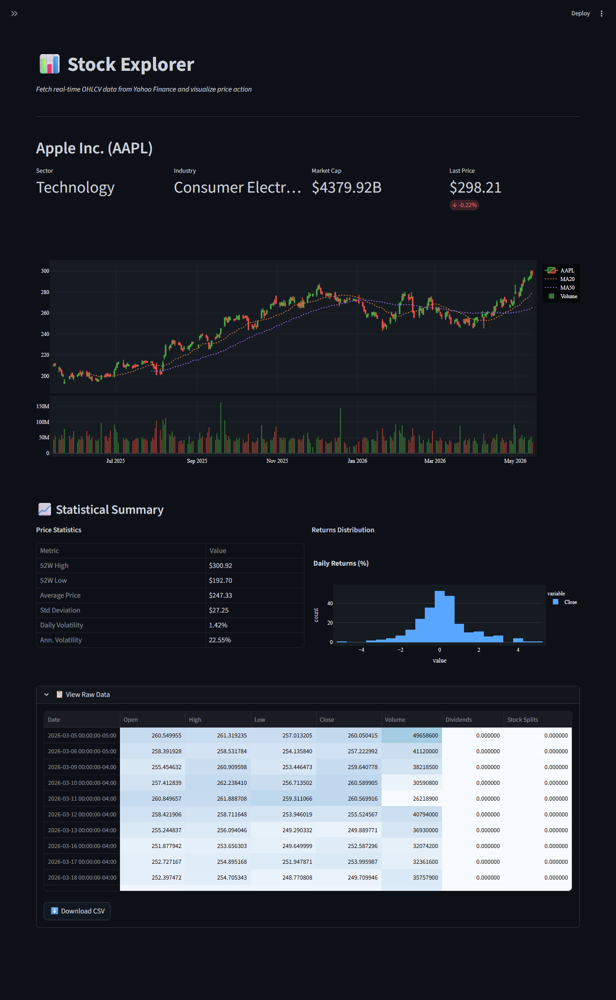
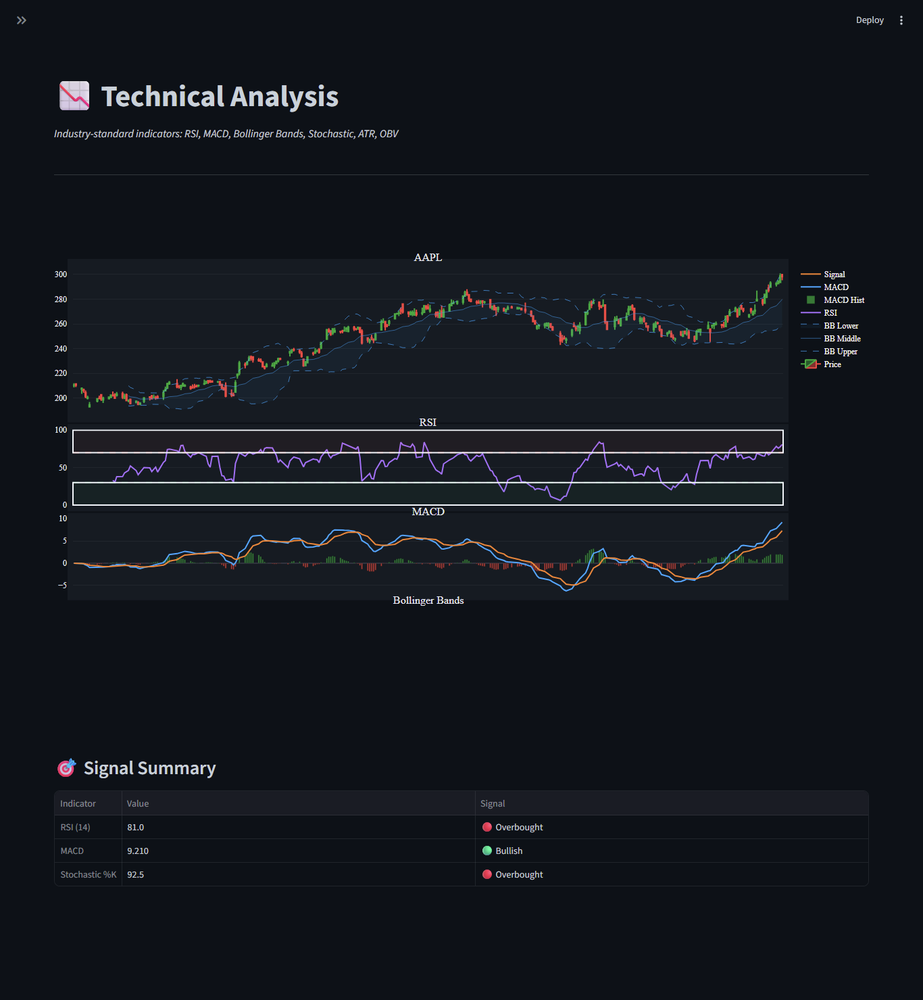
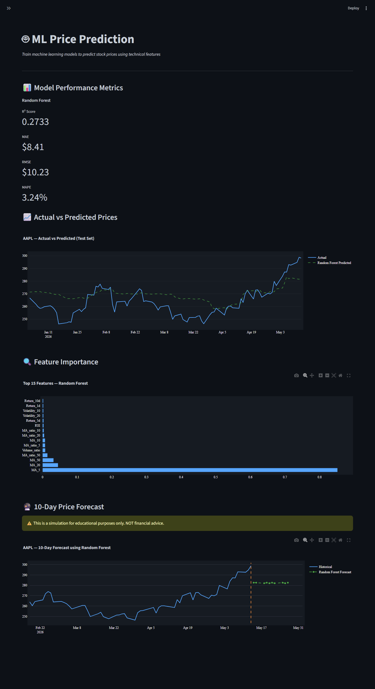
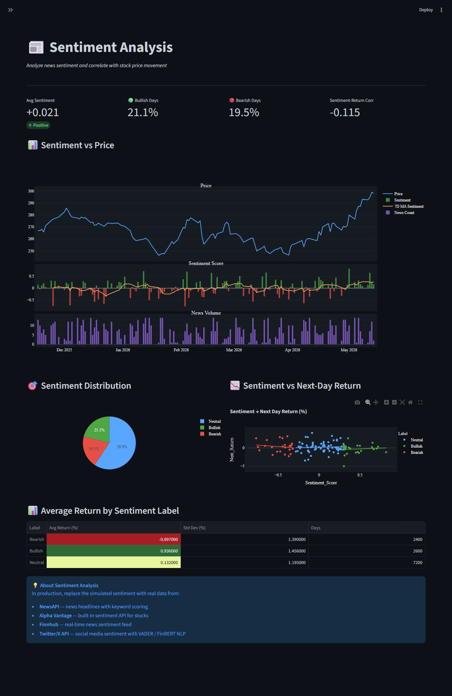
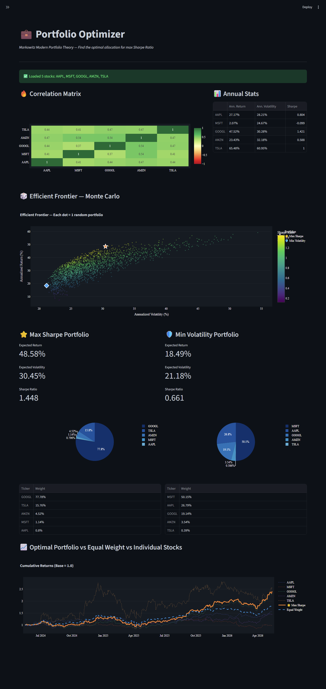

# 📊 Stock Sense AI Data Assistant

Interactive **ML + Analytics Dashboard** built with **Streamlit** for stock market analysis, prediction, portfolio optimization, and sentiment analysis.

---

# 📑 Table of Contents

- [Overview](#-overview)
- [Modules](#-modules)
- [Screenshots](#-screenshots)
- [Stock Sense AI Assistant](#-stock-sense-ai-assistant)
- [How to Run](#-how-to-run)
- [Tech Stack](#-tech-stack)
- [Links](#-links)

---

# 📌 Overview

A complete **Stock Market Data Science System** with:

- 📈 Stock Analysis
- 🤖 Machine Learning Predictions
- 💬 Sentiment Analysis
- 💼 Portfolio Optimization
- 📊 Technical Indicators
- 🔄 Backtesting Strategies
- ⚠️ Risk Dashboard

---

# 🧩 Modules

| Module | Description |
|---|---|
| 🔍 Stock Explorer | Explore stock information and trends |
| 📉 Technical Analysis | RSI, MACD, Moving Averages, Candlestick Analysis |
| 🧠 ML Prediction | Predict future stock prices using ML models |
| 💬 Sentiment Analysis | Analyze news and market sentiment |
| 💼 Portfolio Optimizer | Optimize investments and allocations |
| 🛡️ Risk Dashboard | Evaluate portfolio risks |
| 📚 Fundamental Analysis | Financial statements and company metrics |
| 🌍 Market Overview | Overall market trends and sectors |
| 🔄 Backtesting | Test trading strategies on historical data |
| 🤖 Stock Sense AI | AI assistant for stock-related queries |

---


## 🔍 Stock Explorer



---

## 📉 Technical Analysis



---

## 🧠 ML Prediction



---

## 💬 Sentiment Analysis



---

## 💼 Portfolio Optimizer



---

# 🤖 Stock Sense AI Data Assistant

The project includes a simple AI-powered assistant that can answer questions related to:

- Stock prices
- Investment strategies
- Market trends
- Portfolio management

### Example Questions

```bash
What affects stock prices?
How should I diversify my portfolio?
Which indicators are useful for swing trading?
```

---

# ▶️ How to Run

## 1️⃣ Clone the Repository

```bash
git clone https://github.com/your-username/stock-ds-project.git
cd stock-ds-project
```

## 2️⃣ Install Dependencies

```bash
pip install -r requirements.txt
```

## 3️⃣ Run Streamlit App

```bash
streamlit run app.py
```

---

# 🛠️ Tech Stack

- Python
- Streamlit
- Pandas
- NumPy
- Scikit-learn
- Plotly
- Matplotlib
- NLP / Sentiment Analysis
- Machine Learning

---

# 📂 Project Structure

```bash
stock-ds-project/
│
├── app.py
├── requirements.txt
├── assets/
│   ├── stock_explorer.png
│   ├── technical_analysis.png
│   ├── ml_prediction.png
│   ├── sentiment.png
│   └── portfolio.png
│
├── modules/
├── models/
├── data/
└── README.md
```

---

# 🔗 Links

- 🌐 Live Demo: www.linkedin.com/in/fizza-ahmed

---

